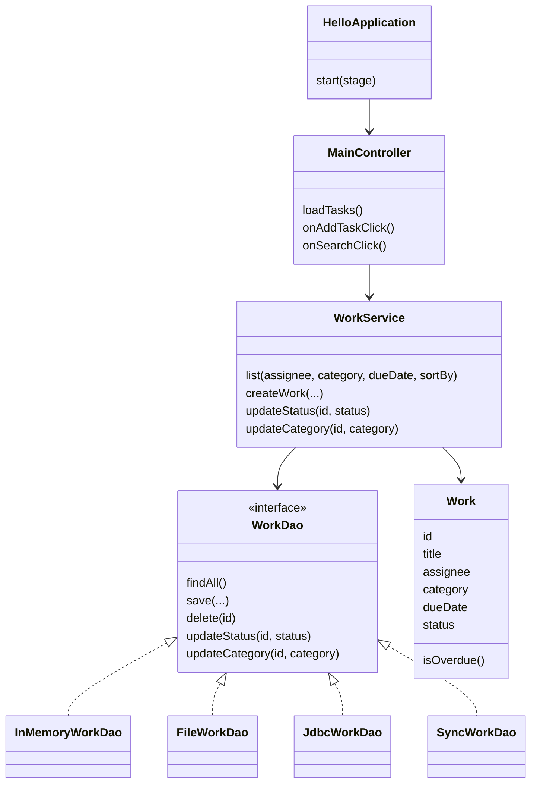
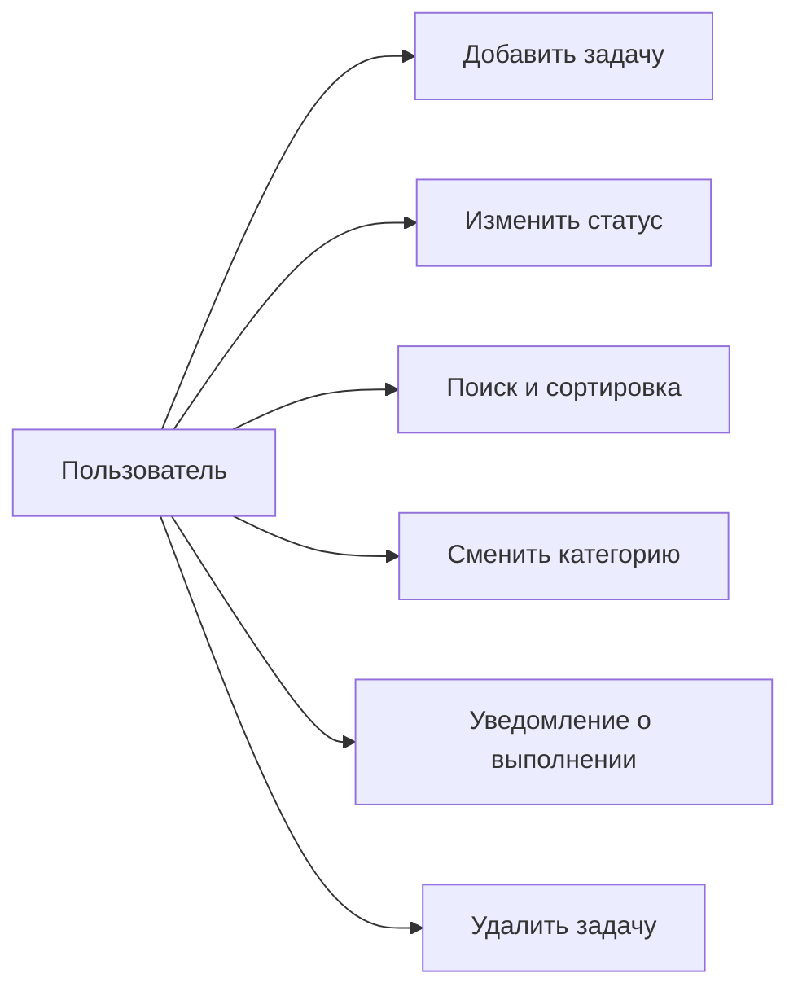

# javaToDo

Лабораторная работа — органайзер проектных задач. Архитектура MVC + DAO.

Десктопное JavaFX-приложение — управление работами (целями) проекта.

---

# Описание

Приложение хранит задачи, позволяет менять статус, искать и сортировать записи, разделять работы по категориям и переносить их между категориями.

При выполнении задачи пользователь получает уведомление.

Основная логика не знает, где лежат данные. Доступ идёт через интерфейс `WorkDao`. Реализации:

* коллекция в памяти
* JSON-файл
* база данных PostgreSQL

Источник выбирается в конфигурационном файле. Это позволяет сменить репозиторий, не трогая GUI и сервис.

---

# Диаграммы

## Диаграмма классов (MVC + DAO)



## Use Case



## Вид приложения

```text
┌──────────────────┬────────────────────────────────┐
│  Добавить задачу │  Карточки задач                │
│                  │                                │
│  Исполнитель     │  название, описание            │
│  Категория       │  исполнитель, срок             │
│  Срок            │  категория, статус             │
│  Сортировка      │  удалить                       │
│  Найти           │                                │
└──────────────────┴────────────────────────────────┘
```

---

# Функционал

| Действие | Описание |
| --- | --- |
| Добавить задачу | Название, описание, исполнитель, категория, срок |
| Изменить статус | Новая / в работе / на проверке / на доработке / завершено |
| Уведомление | Диалог при статусе «Завершено» |
| Категории | Работа, Учёба, Личное |
| Перенос категории | Смена категории на карточке |
| Поиск | По исполнителю, категории, дате окончания |
| Сортировка | По id, сроку, исполнителю |
| Просрочка | Метка на карточке, если срок прошёл и задача не завершена |
| Удаление | Удаляет задачу из выбранного хранилища |

---

# Архитектура

```text
src/main/java/com/example/javatodo/
├── HelloApplication.java
├── Launcher.java
├── controller
│   ├── MainController.java
│   └── AddTaskController.java
├── service
│   └── WorkService.java
├── model
│   ├── Work.java
│   └── WorkStatus.java
├── dao
│   ├── WorkDao.java
│   ├── InMemoryWorkDao.java
│   ├── FileWorkDao.java
│   ├── JdbcWorkDao.java
│   └── SyncWorkDao.java
├── factory
│   └── DataSourceFactoryProvider.java
├── config
│   └── AppConfig.java
└── db
    └── DatabaseConnection.java

src/main/resources/com/example/javatodo/
├── main-view.fxml
├── add-task-dialog.fxml
└── app.css
```

## Основные классы

| Класс | Назначение |
| --- | --- |
| HelloApplication | Точка входа JavaFX |
| MainController | Список задач, поиск, статус, категория |
| AddTaskController | Диалог создания задачи |
| WorkService | Логика: фильтр, сортировка, сроки |
| Work | Модель задачи |
| WorkDao | Интерфейс доступа к данным |
| InMemoryWorkDao | Хранение в коллекции |
| FileWorkDao | Хранение в JSON-файле |
| JdbcWorkDao | Хранение в PostgreSQL |
| SyncWorkDao | Запись сразу во все источники |
| AppConfig | Чтение `application.properties` |

---

# Источники данных

Значение `datasource.type` в конфиге:

```text
inmemory
file
jdbc
sync
```

`sync` дублирует данные в БД, файл и память.

Конфиг программы:

```text
application.properties.example   — шаблон в git
application.properties           — рабочий файл, в git не попадает
```

Скопировать шаблон:

```bash
cp application.properties.example src/main/resources/application.properties
```

---

# Запуск

```bash
cp .env.example .env
docker compose up -d
mvn test
```

Приложение: `HelloApplication` / `mvn javafx:run`.

## Adminer

http://localhost:8081

| Поле | Значение |
| --- | --- |
| System | PostgreSQL |
| Server | db |
| Username | todo |
| Password | todo |
| Database | javatodo |

В Adminer поле **Server** — имя сервиса Docker (`db`), не `localhost`.

Подключение из Java:

```text
jdbc:postgresql://localhost:15432/javatodo
user: todo
password: todo
```

Остановка:

```bash
docker compose down
```

---

* JavaFX 17
* Maven
* FXML
* MVC
* DAO
* PostgreSQL
* JUnit + Mockito
